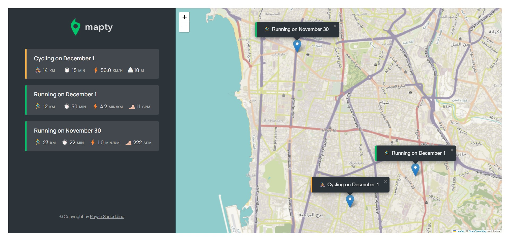

  

<!-- project philosophy -->

## A workout web application for athletes to record their running and cycling activities

Built with the help of JS classes using OOP concepts and the leaflet JS Library for Map manipulation.

  

<!-- Prototyping -->

| 
